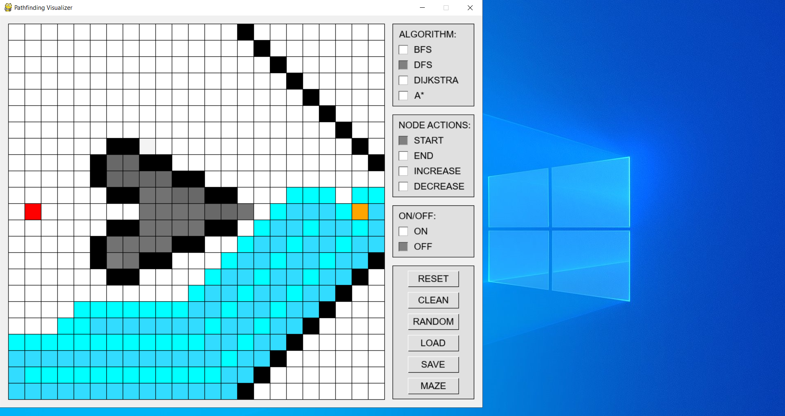
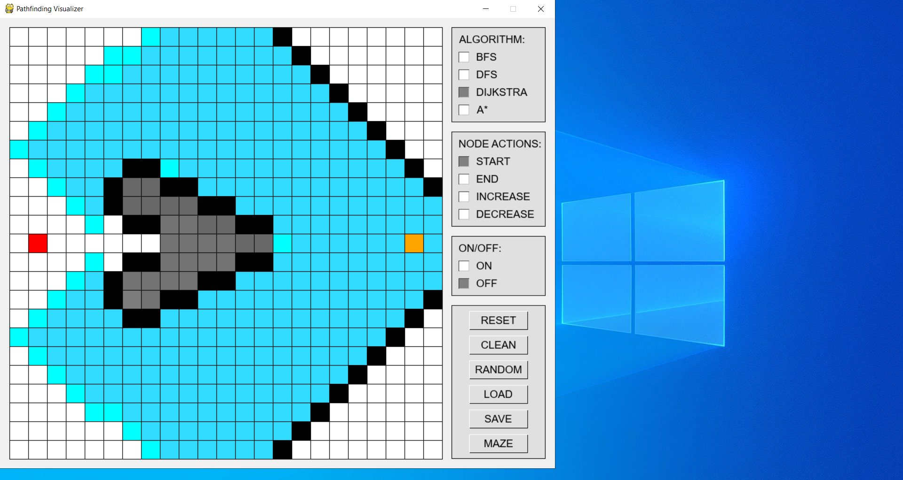
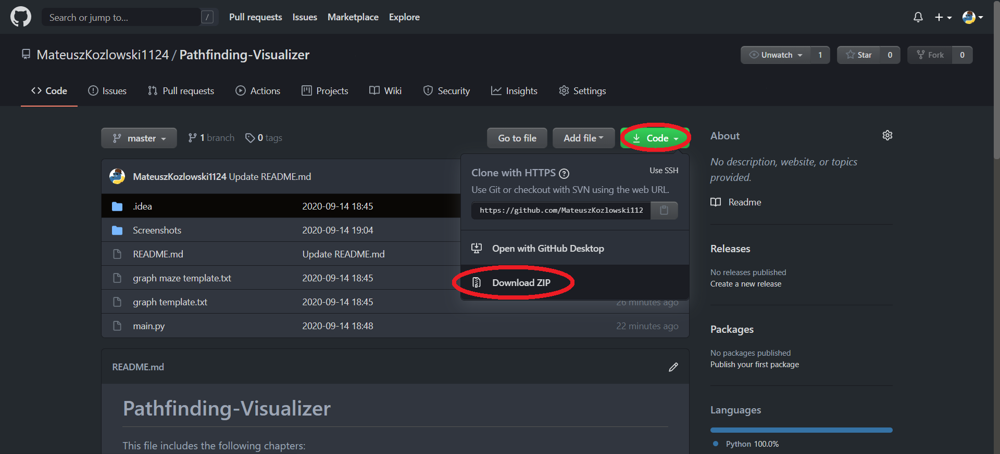

-> [LINK TO A VIDEO SHOWING HOW THE PROGRAM EXACTLY WORKS](https://drive.google.com/file/d/1WucY2i3bAHN4ll92v4lWVaRFYBHctSwg/view?usp=sharing) <-

# Pathfinding-Visualizer

Pathfiding Visualizer is my first Python project, so it isn't written in the best way. The code isn't very clean and the program isn't easily extensible. I plan to improve the code and rebuild the project in the future, but it won't be too soon.

This file includes the following chapters:
1. Code Requirements
2. Project description
3. How to install

# 1. Code Requirements:
Python 3.8 with following modules installed:
* Pygame 1.9

# 2. Project Description:
The project supports following algorithms:

<b> BFS </b> runs on <b> unweighted </b> graphs with <b> O(|V|+|E|) </b> complexity. Guarantees <b> the shortest </b> path.

<b> DFS </b> runs on <b> unweighted </b> graphs with <b> O(|V|+|E|) </b> complexity. Doesn't find the shortest path.

<b> DIJKSTRA </b> runs on <b> weighted </b> graphs with <b> O( (|V|+|E|) * log(|V|) ) </b> complexity. Guarantees <b> the shortest </b> path.

<b> A* </b> runs on <b> weighted </b> graphs. Uses heuristics to guarantee </b> the shortest </b> path much <b> faster </b> than Dijkstra's Algorithm.

Contrary to typical graphs, in my project weights are not a feature of edges but of nodes. The more weight a node has, the darker its color is. Completely black nodes are barriers that cannot be crossed. Completely white nodes weigh 1.

If the path between the starting and ending vertices is found or it turns out that no exists, the animation stops by itself. To repeat it, press the RESET button and turn it on again.

You can draw random graphs, create, save and load your own, or use a special maze.

Some screenshots:

# 3. How to install:
If you're familiar with git you can clone the repo. Otherwise you can simply download whole project as a compressed folder.

Then you need to make sure your device meets the requirements in chapter 1 (appropriate libraries installed).
You can install them with pip from the command line.

Finally run the program using command line. Navigate to the directory, where the project is located and type python main.py

Wait a few second...
And you should see sth like that:

